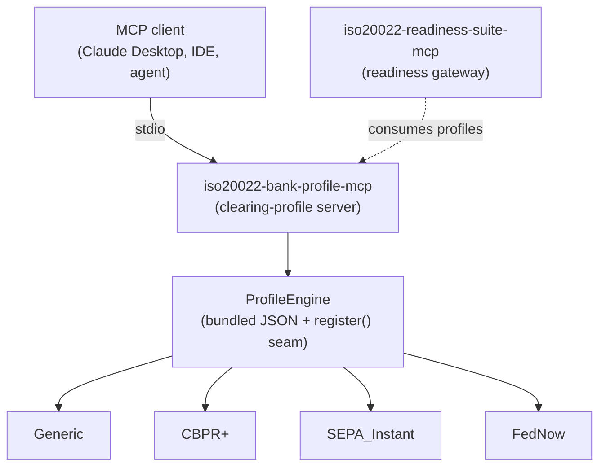

# iso20022-bank-profile-mcp: The ISO 20022 Bank Clearing-Profile Server

[![PyPI Version][pypi-badge]][07]
[![Python Versions][python-versions-badge]][07]
[![License][license-badge]][01]
[![Tests][tests-badge]][tests-url]
[![Quality][quality-badge]][quality-url]
[![OpenSSF Scorecard][scorecard-badge]][scorecard-url]
[![Documentation][docs-badge]][docs-url]

**A fully local, closed-world [Model Context Protocol][mcp] server that
manages, validates, and serves bank-specific ISO 20022 clearing profiles /
rule packs** — the market-practice rules that sit *beyond* structural XSD
validation. It is a foundational member of the
[ISO 20022 MCP Suite](#the-iso-20022-mcp-suite) and a sibling of
[`iso20022-readiness-suite-mcp`](https://github.com/sebastienrousseau/iso20022-readiness-suite-mcp),
whose readiness gateway can consume the profiles this server serves.

> **The November 2026 milestones.** As the major schemes (CBPR+, HVPS+, T2,
> FedNow) tighten their ISO 20022 requirements — structured postal addresses
> chief among them — a payment that was fine yesterday can be rejected
> tomorrow. `iso20022-bank-profile-mcp` turns those scheme rules into
> versioned, agent-callable clearing profiles: `list_profiles` and
> `get_profile` serve them, `lint_payload` evaluates a payload against one,
> and `validate_profile_definition` vets a bank-supplied rule pack. **v0.0.2**,
> stdio by default (plus an optional OAuth 2.1 HTTP transport), 4 read-only
> tools, premium rule-pack entitlement gating, Python 3.10+.

## Contents

- [Overview](#overview)
- [The ISO 20022 MCP Suite](#the-iso-20022-mcp-suite)
- [Install](#install)
- [Quick Start](#quick-start)
- [Tools](#tools)
- [HTTP transport & authentication](#http-transport--authentication)
- [How it fits the suite](#how-it-fits-the-suite)
- [Open-core vs premium](#open-core-vs-premium)
- [When not to use iso20022-bank-profile-mcp](#when-not-to-use-iso20022-bank-profile-mcp)
- [Development](#development)
- [Security](#security)
- [Documentation](#documentation)
- [License](#license)
- [Contributing](#contributing)
- [Acknowledgements](#acknowledgements)

## Overview

The [Model Context Protocol][mcp] (MCP) is an open standard that lets AI agents
and assistants discover and call external tools in a uniform way.
**iso20022-bank-profile-mcp** owns the *market-practice profile layer* of the
ISO 20022 MCP Suite: the scheme-specific and bank-specific rules a payment must
satisfy to clear, which live *above* the XSD and vary by clearing system.

A **clearing profile** is pure data — a `profile_id`, its `market_practice`,
the messages it supports, and a list of declarative `custom_rules`. The server
ships open baseline profiles (`Generic`, `CBPR+`, `SEPA_Instant`, `FedNow`) and
exposes four read-only tools to discover them, fetch them in full, lint a
payload against one, and validate a candidate rule pack.

It is a **fully local, closed-world** server: no network surface, no
sub-servers, no meta-client. Every tool computes from the bundled profile data
and returns typed, JSON-serialisable output; on any failure — a bad input, an
unparseable payload, an unknown profile — it returns an `{"error": ...}`
payload rather than raising into the client transport. XML payloads are parsed
with `defusedxml` only (no XXE / billion-laughs).

- **Website:** <https://sebastienrousseau.github.io/iso20022-bank-profile-mcp/>
- **Source code:** <https://github.com/sebastienrousseau/iso20022-bank-profile-mcp>
- **Bug reports:** <https://github.com/sebastienrousseau/iso20022-bank-profile-mcp/issues>



## The ISO 20022 MCP Suite

`iso20022-bank-profile-mcp` is one of a set of coordinated, vendor-neutral MCP
servers for the ISO 20022 migration. Dependency ranges are kept aligned across
the suite, so the servers co-install cleanly in a single Python environment.

| Server | Scope | Install |
|------|------|------|
| [`iso20022-readiness-suite-mcp`](https://github.com/sebastienrousseau/iso20022-readiness-suite-mcp) | Orchestration gateway: readiness scoring, remediation, clearing-profile linting, and bank-response simulation over the foundational servers | `pip install iso20022-readiness-suite-mcp` |
| [`structured-address-fix-mcp`](https://github.com/sebastienrousseau/structured-address-fix-mcp) | ISO 20022 postal-address classification, assessment, and remediation for the Nov 2026 structured-address cliff | `pip install structured-address-fix-mcp` |
| [`iso20022-mcp`](https://github.com/sebastienrousseau/iso20022-mcp) | Unified gateway meta-tools (`search` / `describe` / `validate` / `generate` / `parse`) across the ISO 20022 message catalogue | `pip install iso20022-mcp` |
| [`camt053-mcp`](https://github.com/sebastienrousseau/camt053-mcp) | ISO 20022 camt.05x bank statements: parse, validate, filter, reverse; MT94x migration; CBPR+ readiness | `pip install camt053-mcp` |
| [`pain001-mcp`](https://github.com/sebastienrousseau/pain001-mcp) | Generate & validate ISO 20022 pain.001 payment-initiation files (v03–v12, pain.008, SEPA) with rulebook checks | `pip install pain001-mcp` |
| [`reconcile-mcp`](https://github.com/sebastienrousseau/reconcile-mcp) | Reconcile ISO 20022 payments and statements; match initiations to their bank-side outcomes | `pip install reconcile-mcp` |
| [`bankstatementparser-mcp`](https://github.com/sebastienrousseau/bankstatementparser-mcp) | Parse bank statements (MT940/MT942 and camt) into structured, agent-friendly data | `pip install bankstatementparser-mcp` |

Where the foundational servers each do one message job well and the readiness
gateway composes them, **this server** owns the clearing profiles: it manages,
validates, and serves the market-practice rule packs the rest of the suite
lints against.

## Install

**iso20022-bank-profile-mcp** runs on macOS, Linux, and Windows and
requires **Python 3.10+** and **pip**. It pulls in the MCP SDK, `pydantic`,
and `defusedxml` automatically — all published on PyPI.

```sh
python -m pip install iso20022-bank-profile-mcp
```

Or run it without installing, straight from PyPI, with
[`uvx`](https://docs.astral.sh/uv/):

```sh
uvx iso20022-bank-profile-mcp
```

<details>
<summary>Using an isolated virtual environment (recommended)</summary>

```sh
python -m venv venv
source venv/bin/activate        # macOS/Linux
venv\Scripts\activate           # Windows
python -m pip install -U iso20022-bank-profile-mcp
```
</details>

## Quick Start

For the 10-minute install → MCP client config → first conversation tutorial,
see [`docs/quickstart.md`](docs/quickstart.md).

Launch the server over stdio (the FastMCP default transport):

```sh
iso20022-bank-profile-mcp
```

Register it with any MCP client (e.g. Claude Desktop) by adding it to the
client's configuration:

```json
{
  "mcpServers": {
    "iso20022-bank-profile": { "command": "iso20022-bank-profile-mcp" }
  }
}
```

The command speaks MCP on stdin/stdout — it is meant to be launched by an MCP
client, not used interactively. The agent can then call the tools below.

You can also invoke the tools in-process — without a transport — straight
through the FastMCP instance. This mirrors what an agent receives over stdio;
everything is local, so no other servers are needed:

```python
import asyncio

from iso20022_bank_profile_mcp import server


async def main() -> None:
    async def call(name, args):
        result = await server.server.call_tool(name, args)
        content = result[0] if isinstance(result, tuple) else result
        return content[0].text if content else ""

    # Which clearing profiles can I target?
    print(await call("list_profiles", {}))
    # -> {"profile_id": "...", "market_practice": "...", "rule_count": ...}, ...

    # Lint a payload against a profile: a CBPR+ address missing its town.
    payload = "<Document><PstlAdr><Ctry>DE</Ctry></PstlAdr></Document>"
    print(await call("lint_payload",
                     {"payload_content": payload, "profile_id": "CBPR+"}))
    # -> {"profile_id": "CBPR+", "is_compliant": false,
    #     "findings": [{"code": "CBPR_MISSING_TOWN", "locator": "TwnNm", ...}]}


asyncio.run(main())
```

## Tools

All tools return JSON-serialisable data; on a domain, validation, or value
error they return an `{"error": ...}` payload rather than raising. Every tool
is a pure, local, read-only, idempotent, closed-world lookup — no network, no
sub-servers.

- `list_profiles` — List the available clearing profiles as lightweight summaries (`profile_id`, `market_practice`, `tier`, `entitled`, `supported_messages`, `rule_count`). Use it to discover the `profile_id` values the other tools accept and see which ones the current caller is entitled to.
- `get_profile` — Return one clearing profile in full, including its rule bodies. On a **premium** profile the caller must be entitled, otherwise it returns a `BP_NOT_ENTITLED` error (see [Open-core vs premium](#open-core-vs-premium)).
- `lint_payload` — Evaluate a raw ISO 20022 payload against a clearing profile and return the findings (a compliant payload yields none). Like `get_profile`, a **premium** profile requires an entitlement or it returns `BP_NOT_ENTITLED`.
- `validate_profile_definition` — Validate a bank-supplied profile / rule-pack definition supplied as raw JSON, confirming its shape and that every rule uses a known assertion verb.

## HTTP transport & authentication

stdio is the default and needs no authentication — one process per operator,
launched by the client, no network surface. For **shared, multi-tenant
deployments** the server also speaks an optional streamable-HTTP transport:

```sh
iso20022-bank-profile-mcp --transport=http --bind=127.0.0.1:8080
```

`--bind` defaults to `127.0.0.1:8080` (loopback-only), so exposing the server
beyond the host is an explicit opt-in (e.g. `--bind=0.0.0.0:8080`). The HTTP
transport **refuses to start without authentication** — it never serves an
unauthenticated endpoint. Two auth modes apply, strongest first:

- **OAuth 2.1 resource server (RFC 9728)** — set
  `ISO20022_BANK_PROFILE_OAUTH_ISSUER` and
  `ISO20022_BANK_PROFILE_OAUTH_AUDIENCE` (both required), with optional
  `ISO20022_BANK_PROFILE_OAUTH_JWKS_URL` (defaults to
  `<issuer>/.well-known/jwks.json`) and `ISO20022_BANK_PROFILE_OAUTH_SCOPES`.
  Every request must carry `Authorization: Bearer <jwt>`; the token is
  validated against the JWKS and its `iss` / `aud` / `exp` / `nbf` / required
  scopes. Failures are rejected `401` / `403` with an RFC 9728
  `WWW-Authenticate` challenge, and protected-resource metadata is served at
  `/.well-known/oauth-protected-resource`. This server validates tokens from
  your existing authorization server (Okta, Auth0, Entra ID, …); running the
  authorization server is out of scope.

  ```sh
  ISO20022_BANK_PROFILE_OAUTH_ISSUER=https://auth.example.com \
  ISO20022_BANK_PROFILE_OAUTH_AUDIENCE=https://mcp.example.com/mcp \
    iso20022-bank-profile-mcp --transport=http --bind=0.0.0.0:8080
  ```

- **Static dev-mode token** — set `ISO20022_BANK_PROFILE_TOKEN` to a shared
  secret; every request must then send `Authorization: Bearer <secret>`. This
  is a single shared secret with no expiry and no scopes — intended for local
  development, not production.

An optional `X-MCP-Tenant` request header is forwarded into the tool-visible
request context for multi-tenant scoping. See
[`docs/transport.md`](docs/transport.md) for the full setup.

## How it fits the suite

This server is the **profile authority** for the ISO 20022 MCP Suite. The
sibling [`iso20022-readiness-suite-mcp`](https://github.com/sebastienrousseau/iso20022-readiness-suite-mcp)
gateway scores and remediates payments *against* clearing profiles; those
profiles are exactly what this server manages, validates, and serves. Aligning
on one profile source keeps the readiness gateway and any bank's own tooling
evaluating a payment against the same market-practice rules.

The profile catalogue is extensible at the seam the whole suite shares. The
`ProfileEngine` loads the open baseline from bundled JSON with
`ProfileEngine.from_bundled()`, and exposes `ProfileEngine.register(profile)`
to add (or replace) a profile at runtime. A **premium, bank-specific rule
pack** is the same shape as a bundled profile — a `ClearingProfile` with a
`profile_id`, a `market_practice`, its `supported_messages`, and a list of
`custom_rules` — so a deployment that embeds this server can register its
licensed packs and serve them alongside the open baseline without changing the
tool surface. See [`docs/profiles.md`](docs/profiles.md) for the rule
mini-language and the `register()` seam.

## Open-core vs premium

The server is **open core**: the baseline scheme profiles and the profile
engine are open source and always available. Higher-tier, institution-specific
capabilities are commercial add-ons that plug into the same profile-engine seam
(the engine already exposes a `register()` hook for runtime-loaded rule packs).

| Capability | Tier |
|---|---|
| Profile engine + rule mini-language | **Open Source** |
| Baseline scheme profiles (Generic, CBPR+, SEPA_Instant, FedNow) | **Open Source** |
| Entitlement gate for premium profiles (tier, scopes, allowlist) | **Open Source** |
| Bank-specific / proprietary scheme rule packs | **Paid** |
| Stateful profile-version history & audit logs | **Paid** |

Nothing in the open-source tier is time-limited or feature-gated.

### How the entitlement gate works

Every clearing profile carries a `tier`: `"open"` (the baseline profiles —
unrestricted and always accessible) or `"premium"` (a licensed rule pack). A
bundled premium **sample** profile, `ACME_Premium`, ships so you can exercise
the gate. `list_profiles` reports each profile's `tier` and a per-caller
`entitled` boolean; `get_profile` and `lint_payload` on a **premium** profile
return a `BP_NOT_ENTITLED` error unless the caller is entitled.

Entitlement is granted by **either** of two independent sources (ORed):

- **OAuth scope** (HTTP transport) — a token bearing the `profile:premium`
  scope is entitled to every premium profile; a token bearing
  `profile:<profile_id>` is entitled to just that one.
- **Environment allowlist** (stdio / dev) — `ISO20022_BANK_PROFILE_ENTITLEMENTS`
  lists the premium `profile_id` values (comma- or space-separated) the
  operator is licensed for; `*` grants all of them.

```sh
# stdio: license the ACME_Premium sample pack for this process
ISO20022_BANK_PROFILE_ENTITLEMENTS=ACME_Premium iso20022-bank-profile-mcp
```

The gate ships in this release; the premium **rule packs** themselves (and
stateful version history / audit logs) remain a paid, out-of-tree concern.
See [`docs/profiles.md`](docs/profiles.md) for the full entitlement model.

## When not to use iso20022-bank-profile-mcp

- **You have no MCP client.** This server only makes sense paired with an
  MCP-aware host (Claude Desktop, the IDE plugins, an agent framework).
- **You need structural XSD validation or message generation.** Those live in
  the foundational suite servers (`iso20022-mcp`, `camt053-mcp`,
  `pain001-mcp`). This server evaluates market-practice rules *above* the XSD;
  it does not parse, generate, or structurally validate messages.
- **You want an end-to-end readiness score and remediation.** That is the job
  of `iso20022-readiness-suite-mcp`, which consumes these profiles. Use it if
  you want scoring, remediation, and bank-response simulation composed
  together.
- **You need a long-lived network service without auth.** stdio is the default
  (one process per operator, no network surface); the optional
  [HTTP transport](#http-transport--authentication) exists for shared,
  multi-tenant deployments but always requires authentication (OAuth 2.1 or a
  static dev-mode token) — it will not serve an unauthenticated endpoint.
- **You need streaming responses.** Tool calls return whole values, not
  streams.

## Development

**iso20022-bank-profile-mcp** uses [Poetry](https://python-poetry.org/) and
[mise](https://mise.jdx.dev/).

```bash
git clone https://github.com/sebastienrousseau/iso20022-bank-profile-mcp.git && cd iso20022-bank-profile-mcp
mise install
poetry install
poetry shell
```

> **Note:** the server is fully local and closed-world, so the test suite runs
> with nothing else installed. See [`CONTRIBUTING.md`](CONTRIBUTING.md).

A `Makefile` orchestrates the quality gates (kept in lockstep with CI):

```bash
make check        # all gates (REQUIRED before commit): lint + type-check + test
make test         # pytest (100% line + branch coverage)
make lint         # ruff + black
make type-check   # mypy --strict
make security     # bandit
```

## Security

`iso20022-bank-profile-mcp` returns errors as data — every tool catches the
documented domain, validation, and value errors and returns an
`{"error": ...}` envelope; it never propagates raw exceptions to the MCP
client. Payloads reached through the clearing-profile engine are parsed with
`defusedxml` only (no XXE / billion-laughs), and the server opens no network
sockets. Reporting practice, supported versions, the attack surface, and the
full supply-chain posture (SLSA L3 provenance, PEP 740 attestations, SBOMs, and
the NIST SP 800-218 SSDF practice mapping) are documented in
[`SECURITY.md`](SECURITY.md). Vulnerabilities go via GitHub Private
Vulnerability Reporting, not public issues.

## Documentation

- [`README.md`](README.md) — this file
- [`CHANGELOG.md`](CHANGELOG.md) — release notes
- [`SECURITY.md`](SECURITY.md) — disclosure + supported versions
- [`SUPPORT.md`](SUPPORT.md) — how to get help
- [`ROADMAP.md`](ROADMAP.md) — what's shipped (HTTP transport, premium entitlement gating) and what's next (richer bank rule packs)
- [`MAINTAINERS.md`](MAINTAINERS.md) — who can merge
- [`docs/quickstart.md`](docs/quickstart.md) — 10-minute install → first conversation
- [`docs/profiles.md`](docs/profiles.md) — the clearing profiles, the rule mini-language, premium rule packs, and the entitlement gate
- [`docs/transport.md`](docs/transport.md) — the optional HTTP transport and OAuth 2.1 setup
- [`glama.json`](glama.json) — Glama directory manifest

---

## MCP Registry

`mcp-name: io.github.sebastienrousseau/iso20022-bank-profile-mcp`

---

## License

Licensed under the [Apache License, Version 2.0][01]. Any contribution submitted
for inclusion shall be licensed as above, without additional terms.

## Contributing

Contributions are welcome — see the [contributing instructions][04]. Thanks to
all [contributors][05].

## Acknowledgements

Built alongside the foundational servers of the ISO 20022 MCP Suite and the
[Model Context Protocol][mcp] Python SDK.

[01]: https://opensource.org/license/apache-2-0/
[04]: https://github.com/sebastienrousseau/iso20022-bank-profile-mcp/blob/main/CONTRIBUTING.md
[05]: https://github.com/sebastienrousseau/iso20022-bank-profile-mcp/graphs/contributors
[07]: https://pypi.org/project/iso20022-bank-profile-mcp/
[mcp]: https://modelcontextprotocol.io
[docs-badge]: https://img.shields.io/badge/Docs-iso20022--bank--profile-blue?style=for-the-badge
[docs-url]: https://sebastienrousseau.github.io/iso20022-bank-profile-mcp/
[license-badge]: https://img.shields.io/pypi/l/iso20022-bank-profile-mcp?style=for-the-badge
[pypi-badge]: https://img.shields.io/pypi/v/iso20022-bank-profile-mcp?style=for-the-badge
[python-versions-badge]: https://img.shields.io/pypi/pyversions/iso20022-bank-profile-mcp.svg?style=for-the-badge
[quality-badge]: https://img.shields.io/github/actions/workflow/status/sebastienrousseau/iso20022-bank-profile-mcp/ci.yml?branch=main&label=Quality&style=for-the-badge
[quality-url]: https://github.com/sebastienrousseau/iso20022-bank-profile-mcp/actions/workflows/ci.yml
[scorecard-badge]: https://api.scorecard.dev/projects/github.com/sebastienrousseau/iso20022-bank-profile-mcp/badge?style=for-the-badge
[scorecard-url]: https://scorecard.dev/viewer/?uri=github.com/sebastienrousseau/iso20022-bank-profile-mcp
[tests-badge]: https://img.shields.io/github/actions/workflow/status/sebastienrousseau/iso20022-bank-profile-mcp/ci.yml?branch=main&label=Tests&style=for-the-badge
[tests-url]: https://github.com/sebastienrousseau/iso20022-bank-profile-mcp/actions/workflows/ci.yml
